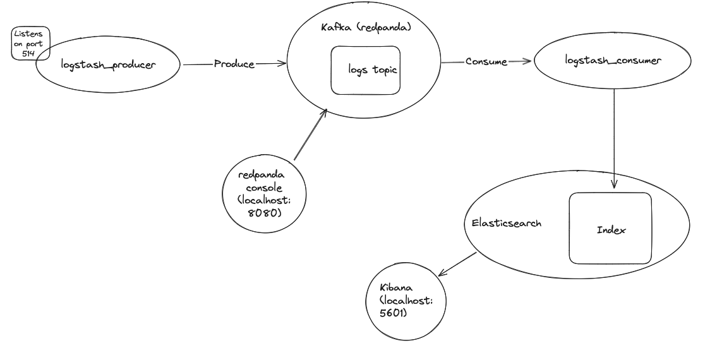
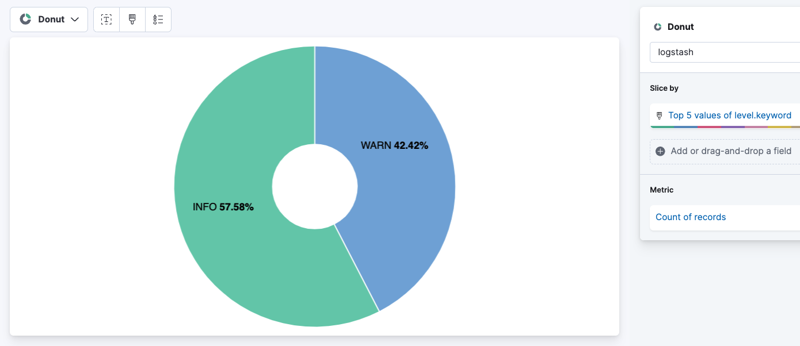

# Intro

The purpose of this project is to spin up an ELK stack locally, and learn about common logging stack tools, without having to connect to a Telemetry lab environment (the Kafka handshake process causes a real headache!).

If you add a `level` field to the log, it will transform:
- INFO/info/information/INFORMATION to INFO
- WARN/warn/warning/WARNINIG to WARN

## Basic usage
1. From the top level of this repo, run: 
```
docker-compose -f ./docker-compose.yaml up
```

2. Install a command-line Kafka tool e.g. `kaf`, and use it to create a topic called `logs`.

3. From a different shell, use netcat to send log messages to logstash_ingest, which listens on port 514: 
```
echo "{\"header\":\"this is a header\",\"msg\":\"hello world\",\"level\":\"warning\"}" | nc localhost 514
```

4. Access localhost:8080 in the browser, you should see your message in the redpanda console.

5. Access localhost:5601 in the browser, you should see your messages in Kibana.

## Architectural Decisions

1. Opted to use redpanda over vanilla Kafka, in order to reduce complexity (specifically having to manage Zookeeper).

2. Used 2 seperate containers for logstash, one in which it acts as a consumer to kafka, and one in which it acts as a producer. This is more 'production-like' than trying to have one container do both things. 

3. Used docker-compose to coordinate the many different containers required, as it would be a lot quicker to get running than attempting it in K8s...



## Gotchas/Learning

### Elasticsearch
- Had to set the vm.max_map_count within the colima config file, see [this comment](https://github.com/abiosoft/colima/issues/384#issuecomment-1235753254) on the github issue.
- Noticed es/kibana kept dieing due to 137 error codes (commonly due to OOM issues). Validated that there was a memory issue by `colima ssh`, installing `htop`, and viewing the utilization data in the colima VM. Then added extra memory (8GB) in the colima config file, and set the `mem_limit` for es in the docker_compose file.
- Disabled `xpack.security.enabled=false` to stop es healthcheck failing on license check. 

### Logstash 
- Had to ensure I was mounting the logstash configuration to the correct location - as logstash expects it in `/etc/logstash/conf.d`
- Can debug logstash filters by setting the Output to StdOut, which outputs to Docker logs.
- To access JSON fields inside of a string, e.g: `"message": "{"field1": "x", "field2": "x"}`, need to first use the JSON filter to extract them to json objects.

### Kibana
- In the Kibana UI, told ElasticSearch to monitor itself, rather than setting up filebeat. This let us see measures of Kibana's health.
- Created a (very basic) dashboard from my (very basic) log messages:

